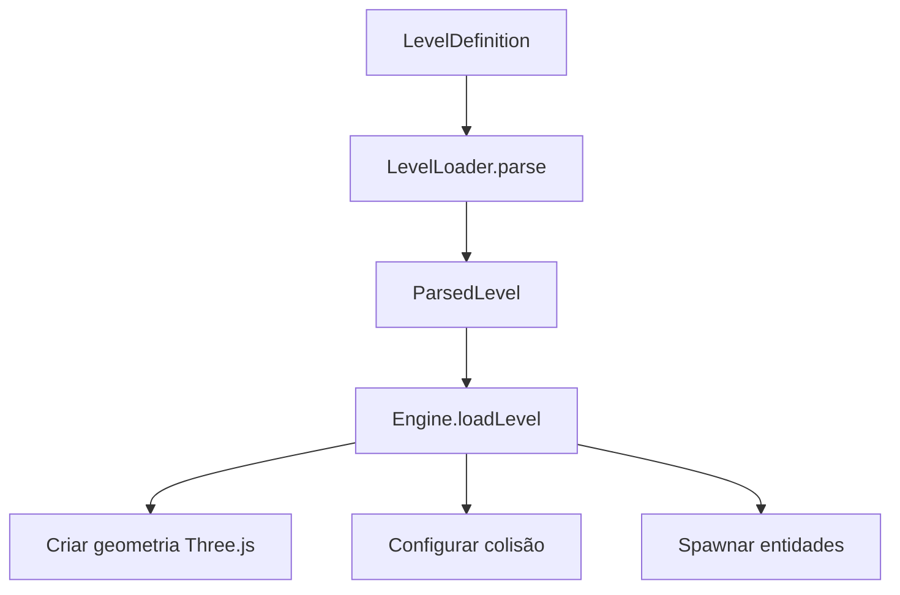
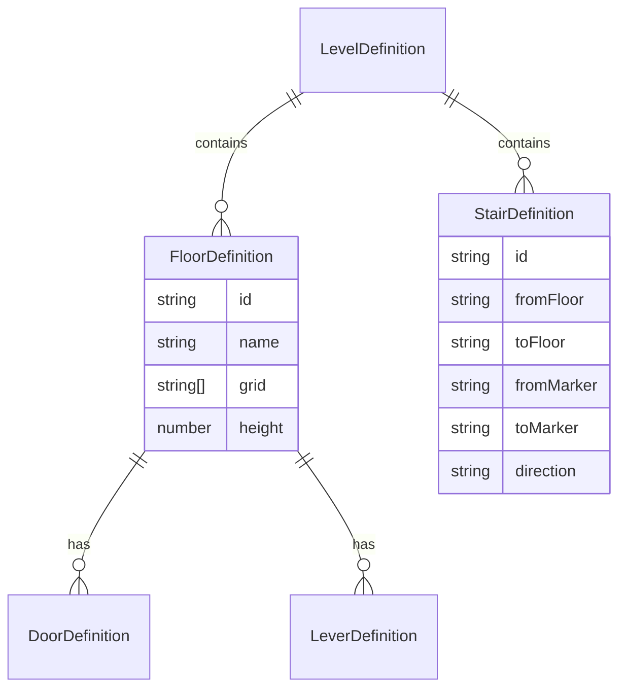
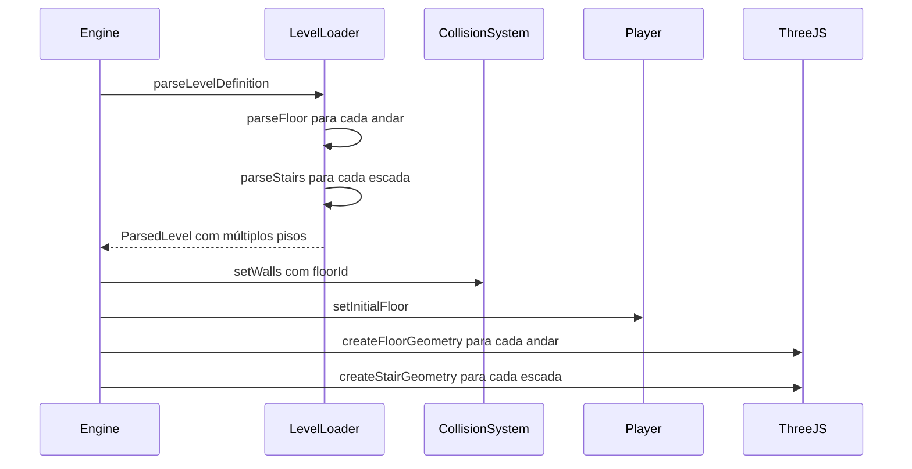
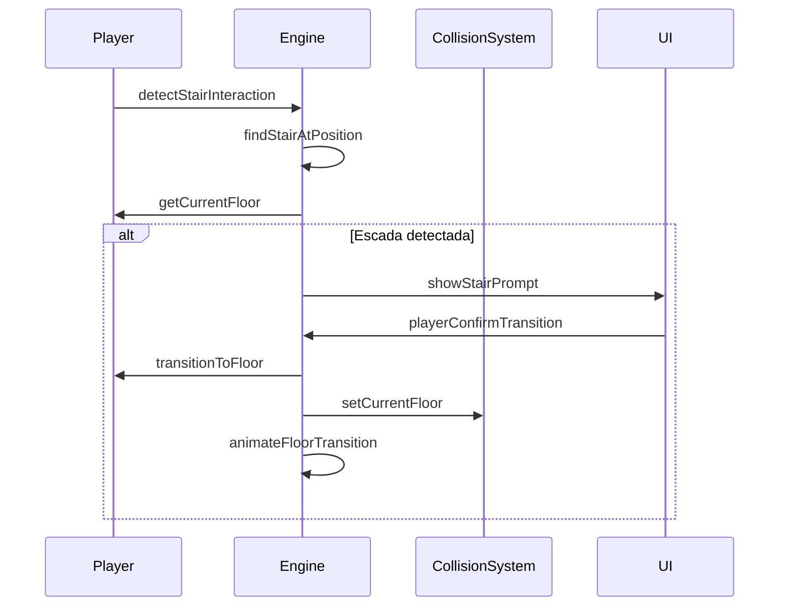

# Plano de Implementação: Níveis com Múltiplos Andares e Escadas

## 1. Visão Geral

Este plano descreve como implementar um sistema de múltiplos andares com escadas no jogo Crimson Halls. Atualmente o jogo funciona em um único plano 2D (XZ) com altura fixa. A implementação adicionará suporte a:

- Múltiplos pisos/andares em um mesmo nível
- Escadas para transição entre andares
- Coordenada Y dinâmica para o jogador
- Sistema de colisão considerando altura

## 2. Análise da Arquitetura Atual

### 2.1 Estrutura de Níveis

```typescript
// Atual: Grid único 2D
export interface LevelDefinition {
  id: string
  name: string
  grid: string[]  // Array de strings representando o mapa
  doors?: DoorDefinition[]
  levers?: LeverDefinition[]
  waves?: WaveDefinition[]
  // ...
}
```

### 2.2 Sistema de Coordenadas

- **Posição do jogador**: `Vector3(x, y, z)` onde `y` é fixo em `PLAYER_CONFIG.eyeHeight`
- **Colisão**: AABB 2D no plano XZ, sem considerar altura
- **Paredes**: `WallAABB` com `minX, maxX, minZ, maxZ` (sem Y)

### 2.3 Fluxo de Renderização



## 3. Arquitetura Proposta

### 3.1 Novas Interfaces

```typescript
// Definição de um andar/piso
export interface FloorDefinition {
  id: string           // Identificador único do andar
  name?: string        // Nome opcional para exibição
  grid: string[]       // Grid 2D do andar
  height: number       // Altura base do piso (Y)
  doors?: DoorDefinition[]
  levers?: LeverDefinition[]
  atmosphere?: LevelAtmosphere
}

// Definição de escada/escada
export interface StairDefinition {
  id: string                    // Identificador único
  fromFloor: string             // ID do andar de origem
  toFloor: string               // ID do andar de destino
  fromMarker: string            // Marcador no grid de origem (ex: 'L1')
  toMarker: string              // Marcador no grid de destino (ex: 'L2')
  direction: 'up' | 'down'      // Direção da escada
}

// LevelDefinition estendido
export interface LevelDefinition {
  id: string
  name: string
  floors: FloorDefinition[]      // Array de andares
  stairs: StairDefinition[]      // Array de escadas
  startFloor?: string            // Andar inicial (padrão: primeiro)
  // ... manter compatibilidade com níveis antigos
}
```

### 3.2 Diagrama de Relacionamentos



### 3.3 Modificações no Player

```typescript
export class Player {
  readonly position = new THREE.Vector3()
  currentFloorId: string = ''  // ID do andar atual
  currentFloorHeight: number = 0  // Altura base do andar atual
  
  // Novo método para transição de andar
  transitionToFloor(floorId: string, targetX: number, targetZ: number, targetYaw: number): void {
    // Animar transição
    // Atualizar currentFloorId
    // Atualizar posição
  }
}
```

### 3.4 Modificações no CollisionSystem

```typescript
export interface WallAABB {
  minX: number
  maxX: number
  minZ: number
  maxZ: number
  floorId: string  // Novo: ID do andar
  floorHeight: number  // Novo: altura base do andar
}

export class CollisionSystem {
  private walls: WallAABB[] = []
  private currentFloorId: string = ''
  
  setCurrentFloor(floorId: string): void {
    this.currentFloorId = floorId
  }
  
  // Filtra paredes pelo andar atual
  private getWallsForCurrentFloor(): WallAABB[] {
    return this.walls.filter(w => w.floorId === this.currentFloorId)
  }
}
```

## 4. Fluxo de Implementação

### 4.1 Diagrama de Sequência - Carregamento de Nível Multi-Andar



### 4.2 Diagrama de Sequência - Transição de Andar



## 5. Detalhes de Implementação

### 5.1 Marcadores de Escada no Grid

Adicionar novos caracteres ao LevelLoader:

```typescript
const CHAR_STAIR_UP = 'L'     // Escada para subir
const CHAR_STAIR_DOWN = 'l'   // Escada para descer
```

### 5.2 Exemplo de Nível com Dois Andares

```typescript
export const levelMultiFloor: LevelDefinition = {
  id: 'level-multifloor',
  name: 'Torre de Dois Andares',
  floors: [
    {
      id: 'floor-1',
      name: 'Térreo',
      height: 0,
      grid: [
        '##########',
        '#P.......#',
        '#........#',
        '#...L....#',  // L = escada para subir
        '#........#',
        '##########',
      ],
    },
    {
      id: 'floor-2',
      name: 'Andar Superior',
      height: 10,  // 10 metros acima do térreo
      grid: [
        '##########',
        '#........#',
        '#...l....#',  // l = escada para descer
        '#........#',
        '#...E....#',  // Inimigo no andar de cima
        '##########',
      ],
    },
  ],
  stairs: [
    {
      id: 'stair-1-2',
      fromFloor: 'floor-1',
      toFloor: 'floor-2',
      fromMarker: 'L1',  // Primeira ocorrência de 'L' no floor-1
      toMarker: 'l1',    // Primeira ocorrência de 'l' no floor-2
      direction: 'up',
    },
  ],
}
```

### 5.3 Renderização de Múltiplos Andares

Estratégia de renderização:

1. **Todos os andares são renderizados simultaneamente**
2. **Andar atual**: renderização completa com iluminação
3. **Outros andares**: renderização com transparência/neblina para dar profundidade
4. **Ocultação**: opcionalmente, esconder andares acima do atual para melhor visibilidade

### 5.4 Transição Suave entre Andares

```typescript
// Animação de transição
const TRANSITION_DURATION = 0.5  // segundos

interface FloorTransition {
  fromFloor: string
  toFloor: string
  fromHeight: number
  toHeight: number
  progress: number  // 0 a 1
}
```

## 6. Lacuna 1 — Editor de Níveis (LevelEditor.tsx)

> O checklist original não mencionava o editor. Como `LevelDefinition` passa a
> suportar `floors[]`/`stairs[]`, o editor precisa acompanhar — sem quebrar o
> fluxo de níveis de andar único (legado).

### 6.1 Estado atual

`src/ui/LevelEditor.tsx` opera sobre UM grid 2D:

- `Draft { id, name, grid: string[][], doorTargets }` persistido em `localStorage`
  (`DRAFT_KEY = 'crimson-halls-editor-draft'`).
- Ferramentas de pintura (parede `#`, chão `.`, jogador `P`, inimigos, vida,
  munição, porta `D`, cresset `X`, pilar `O`).
- Exporta `LevelDefinition` com `grid` + `doors` (via `buildDoors`, que varre o
  grid em ordem e gera `D1, D2, ...`).
- "Testar no jogo" → `playCustomLevel(definition)` (caminho `customLevel`, fora
  da campanha/save).
- `importJson`, `loadBuiltin` (dropdown de `LEVELS`), redimensionar, copiar/
  baixar JSON.

### 6.2 Modelo de rascunho (Draft v2) + migração

```typescript
interface FloorDraft {
  id: string
  name: string
  height: number          // altura base do andar (Y)
  grid: string[][]        // células DO andar
  doorTargets: string[]   // portas D* deste andar → nível destino
}
interface Draft {
  id: string
  name: string
  floors: FloorDraft[]        // >= 1 andar
  stairs: StairDefinition[]   // escadas entre andares
  startFloorId: string        // andar inicial
}
```

- `loadDraft` continua lendo a MESMA chave, mas distingue os formatos pela
  presença de `data.floors`. Draft v1 (com `grid` raiz) é migrado em memória
  para `floors: [{ id: 'floor-1', name: 'Andar 1', height: 0, grid, doorTargets }]`.
- O salvamento (`useEffect`) grava sempre o formato v2.

### 6.3 Navegação entre andares na edição

- Barra de abas de andares (nome + altura) acima do canvas; `activeFloorIndex`
  controla qual andar está visível/desenhado.
- Botões **"+ Andar"** (duplica o grid ativo ou cria vazio com borda `#`) e
  **"Remover andar"** (com confirmação; nunca remove o último).
- Campos editáveis por andar: `id`, `name`, `height`.
- Toda tool de pintura opera no grid do andar ativo. `buildDoors` passa a ser
  por andar (cada `FloorDraft` gera suas portas).

### 6.4 Escadas no editor

- Novas ferramentas `L` (subir) e `l` (descer) no `TOOL_CHAR`/`TOOLS`, com cores
  próprias e desenho no canvas.
- **Auto-correspondência de stairs** (fase 1, recomendada): ao pintar/remover
  marcadores, o editor regenera `stairs` pela mesma regra do `LevelLoader` —
  o i-ésimo `L` do andar A (em ordem de varredura) liga ao i-ésimo `l` do andar
  B com `height` maior (subir). A lista resultante é sempre exposta no JSON.
- Painel lateral **"Escadas (N)"**: lista cada stair
  (`de floor-1 (r,c) → floor-2`, direção), com remoção individual.
- Fase 2 (opcional): UI explícita de binding (select andar origem + índice do
  marcador → andar destino) para casos em que a auto-correspondência não basta.

### 6.5 Exportação/importação JSON

- `definition` construído inclui `floors[]`, `stairs[]`, `startFloorId` quando
  o rascunho tem >1 andar OU o usuário pediu explicitamente.
- **Compatibilidade legada**: com 1 andar e sem escadas, exportar no formato
  antigo `{ id, name, grid, doors }` para o `LevelLoader` legado continuar
  consumindo e o diff com níveis existentes não explodir. (Alternativa aceitável:
  exportar sempre `floors` com 1 andar; o import de JSON antigo converte para
  `floors[0]`.)
- `importJson`/`loadBuiltin`: se o JSON tem `floors` → popula andares/stairs/
  startFloor/activeFloorIndex; se só tem `grid` → converte para 1 andar.
- `doors` importadas → `doorTargets` por andar.

### 6.6 "Testar no jogo"

- `playCustomLevel(definition)` inalterado; o `definition` pode ter
  `floors`/`stairs`. O Engine consome o novo formato normalmente.

### 6.7 Estimativa de escopo (separada)

| Item | Esforço |
|---|---|
| Draft v2 + migração de draft v1 | ~0,5d |
| Abas de andares + add/remove + nome/altura | ~0,5d |
| Tools de escada (L/l) + auto-correspondência de stairs | ~0,75d |
| Export legado vs multi-floor + import/load builtin | ~0,75d |
| Painel de escadas + UI/CSS | ~0,5d |
| Testes (regressão single-floor + casos multi-floor) | ~0,5d |
| **Total** | **~3,5d** |

## 7. Lacuna 2 — Sistema de Save/Checkpoint (saveSystem.ts)

### 7.1 Descoberta importante do código atual

`saveSystem.ts` **NÃO persiste a posição do jogador**. `SaveData` guarda apenas
`version | levelId | health | ammo | kills | difficulty | currency |
weaponUpgrades | skillPoints | skillUpgrades` (`SAVE_VERSION = 3`). Em
`continueGame`/`retryLevel` (gameStore.ts), o jogador nasce no marcador `P` do
nível (`parsed.playerSpawn`). A sessão por nível (inimigos mortos, pickups,
alavancas) fica **em memória** na Engine (`levelSessions`, limpa quando
`runId` muda) — não vai para o localStorage.

### 7.2 Implicação para multi-floor

Como a posição não é persistida, o risco real **não é** "aparecer dentro da
geometria de outro andar" — é **nascer no andar errado**. O `P` de um nível
multi-andar vive em UM andar; se o checkpoint foi feito no andar 2 e o andar
padrão é o térreo, ao continuar o jogador volta ao térreo mesmo tendo saído do
andar 2.

### 7.3 Solução: persistir `floorId` no checkpoint

Bump `SAVE_VERSION` 3 → **4**:

```typescript
interface SaveData {
  version: number          // 4
  levelId: string
  floorId?: string         // NOVO: andar do checkpoint (opcional = nível legado)
  // ...campos existentes inalterados
}
```

- `saveGame()` ganha `floorId`; `enterDoor` e `completeLevel` gravam o andar
  atual do jogador.
- `continueGame`/`retryLevel`: ao iniciar o nível, o Engine lê `floorId` e usa o
  marcador `P` DAQUELE andar. Regra de fallback:
  `floorId no nível → startFloorId → floor com 'P' → floors[0]`.
- **Níveis legados** (sem `floors`): `floorId` é omitido do save (campo
  opcional) — zero impacto em saves existentes e nenhuma alteração de fluxo.

### 7.4 Migração de saves antigos (v1, v2, v3)

Todos os caminhos de `loadGame()` retornam o novo formato com `floorId`
ausente/`undefined`. `continueGame` trata `undefined` como "usar o andar padrão
do nível". Não há conversão destrutiva — basta o código tolerar o campo
ausente.

### 7.5 Extensão futura (registrada, fora do escopo atual)

Se futuramente persistirmos posição `(x, y, z, yaw)`, `floorId` passa a ser
obrigatório junto com `y` (que deve ser `floor.height + eyeHeight`). Validação
no load: `y` inconsistente com `floor.height` ⇒ respawn no `P` do `floorId`.

### 7.6 Testes

Ampliar `saveSystem.test.ts`:
- round-trip com `floorId` presente e ausente;
- migração v3→v4 (sem `floorId` → campo opcional `undefined`);
- `continueGame` com `floorId` válido, inválido (fallback) e ausente (legado).

## 8. Lacuna 3 — Linha de Visão e Raycast entre Andares

> O plano original só filtra a COLISÃO DE MOVIMENTO por `floorId`. Todos os
> caminhos que consultam `this.walls` (todas as paredes) ou `wallMeshes` (uma
> mesh única mergeada) precisam do mesmo filtro — senão um inimigo no andar de
> cima "vê"/atira no jogador do andar de baixo através do chão.

### 8.1 Inventário dos caminhos (estado atual)

| Caminho | Código atual | Problema se não filtrar |
|---|---|---|
| Movimento do jogador | `CollisionSystem.isBlocked/resolvePosition` | Atravessa paredes de outro andar (já coberto no plano) |
| LOS do inimigo | `Enemy.update` → `collision.hasClearLine` | Inimigo de cima "vê" o player de baixo através do chão |
| Projétil de inimigo | `Projectile.update` → `collision.isBlocked` | Projétil atravessa/para no chão do outro andar |
| Foguete | `updateRockets` → `collision.isBlocked` | Explode na geometria de outro andar |
| Raycast de mira | `HitscanWeapon.firePellet` → `intersectObjects(getTargets())` com `wallMeshes` (merge único) | Tiro atravessa teto/chão e acerta inimigo de outro andar — ou a parede de outro andar bloqueia o tiro no andar atual |
| Corpo a corpo | `MeleeWeapon` → itera TODOS os inimigos (distância XZ + ângulo) | Acerta inimigo de outro andar com XZ coincidente |
| Minimapa | `updateMinimap` → desenha `parsed.walls` | Desenha paredes de todos os andares sobrepostas |
| Spawn de inimigo | `spawnPosition.ts` → `collision.isBlocked` | Posiciona inimigo "dentro" de parede de outro andar |

### 8.2 Solução — três camadas

**Camada 1 — paredes com `floorId` nos dois mundos:**
- `WallAABB` ganha `floorId: string` (+ `floorHeight: number` para futura física
  de altura).
- `CollisionSystem` ganha `currentFloorId` e índices por andar
  (`Map<floorId, WallAABB[]>`, evitando `filter` por frame). Métodos públicos
  aceitam `floorId` opcional; sem ele, usam `currentFloorId`:
  - `setCurrentFloor(floorId)` — usado pelo movimento do jogador.
  - `isBlocked(x, z, radius, floorId?)`
  - `hasClearLine(x0, z0, x1, z1, floorId?)`
- **Geometria de raycast por andar**: `buildLevel` NÃO mergeia todas as paredes
  do nível em uma mesh única. Cria **um `Group` por andar** com a mesh mergeada
  do andar, cada uma com `userData.floorId` (e `userData.isWall`). Assim o
  raycast filtra por andar sem tocar na geometria de outros andares.

**Camada 2 — entidades com `floorId`:**
- `Enemy` ganha `floorId` (cada `EnemySpawn` do parse ganha `floorId`).
- `Projectile` e `Rocket` ganham `floorId` (herdado de quem disparou: inimigo →
  `enemy.floorId`; jogador → `player.currentFloorId`).
- `Pickup`, `Door`, `Lever`, `Note`, `Cresset`, `WaveSpawn` ganham `floorId` no
  parse. Interações por proximidade XZ passam a exigir o mesmo `floorId`.
- `ParsedLevel` expõe os spawns com `floorId` e `playerSpawn.floorId`.

**Camada 3 — filtros aplicados em cada consumidor:**
- **LOS do inimigo**: `Enemy.update` só persegue/ataca se
  `player.currentFloorId === this.floorId` E `hasClearLine(..., this.floorId)`.
  A engine pode passar `playerPosition: null` quando o player está em outro
  andar (inimigo fica idle). **Restrição documentada**: inimigos NÃO usam
  escadas — ficam presos ao andar (§12.2).
- **Projétil/foguete**: `Projectile.update` e `updateRockets` chamam
  `collision.isBlocked(pos.x, pos.z, radius, this.floorId)`. `explodeAt` só
  afeta entidades do MESMO andar (dano por `floorId`, não por `|Δy|` — mais
  simples e previsível).
- **Mira do jogador**: `getTargets()` retorna apenas `wallMeshes` com
  `userData.floorId === player.currentFloorId` + inimigos vivos do mesmo andar.
- **Corpo a corpo**: `getEnemies()` na engine já entrega só inimigos do andar
  atual (mesmo filtro).
- **Minimapa**: desenha `parsed.walls` filtrados por `currentFloorId`.
- **Spawn de inimigo**: `spawnPosition` recebe `floorId` e valida contra as
  paredes DAQUELE andar.

### 8.3 Nota sobre `hasClearLine` 2D

`hasClearLine` continua 2D (XZ) e isso é suficiente: a checagem de mesmo andar
é feita ANTES, por `floorId`. Inimigo no andar 2 (y≈10) vs player no andar 1
(y≈0) com XZ idênticos: `floorId` difere → sem LOS → idle. O chão/teto NUNCA
entra como obstáculo de LOS porque só as paredes do andar do inimigo são
consultadas.

### 8.4 Testes

- `CollisionSystem.test.ts`: duas salas empilhadas com XZ sobrepostos —
  `hasClearLine`/`isBlocked` devem ignorar paredes do outro andar.
- `Weapon.test.ts`: inimigo em outro andar (mesmo XZ) → NÃO é acertado pelo
  raycast nem pelo melee.

## 9. Lacuna 4 — Nível de Teste Isolado (protótipo)

> Antes de aplicar multi-floor a qualquer nível real da campanha, validar em um
> nível isolado: fora da campanha, sem inimigos, sem portas, sem integração com
> save.

### 9.1 Definição

Novo arquivo `src/levels/levels/level-multifloor-test.ts`:

```typescript
export const levelMultiFloorTest: LevelDefinition = {
  id: 'level-multifloor-test',
  name: 'Teste Multi-Andar',
  startFloor: 'floor-1',
  floors: [
    {
      id: 'floor-1', name: 'Térreo', height: 0,
      grid: [
        '##############',
        '#P...........#',   // P = spawn do teste (andar 1)
        '#............#',
        '#...L........#',   // L = escada para subir
        '#............#',
        '#............#',
        '##############',
      ],
    },
    {
      id: 'floor-2', name: 'Andar Superior', height: 5, // topo do térreo (WALL_HEIGHT)
      grid: [
        '##############',
        '#............#',
        '#............#',
        '#...l........#',   // l = escada para descer
        '#............#',
        '#............#',
        '##############',
      ],
    },
  ],
  stairs: [
    { id: 'stair-1-2', fromFloor: 'floor-1', toFloor: 'floor-2',
      fromMarker: 'L1', toMarker: 'l1', direction: 'up' },
  ],
}
```

- Adicionado a `ALL_LEVELS` (aparece no dropdown do editor) mas **NÃO** em
  `CAMPAIGN_ORDER` (fora do fluxo de save/portas/vitória).
- Sem `doors`, `waves`, `waveSpawns`, `levers`, `notes` — teste estrutural puro.
- **Acesso para testar**: Editor de Níveis → "Carregar nível existente…" →
  "Teste Multi-Andar" → "Testar no jogo" (caminho `customLevel`, sem tocar em
  save).

### 9.2 Critérios de aceite (validação manual)

1. **Geometria**: no térreo, vê-se o teto em `y = WALL_HEIGHT` e o andar
   superior à distância; o chão do andar 2 renderiza em `y = 5`. Sem
   z-fighting/artefatos entre andares.
2. **Colisão por andar**: no térreo as paredes do térreo bloqueiam; no andar 2
   o jogador "caminha sobre" salas do térreo (XZ que eram parede lá não
   bloqueiam aqui) e as paredes do andar 2 bloqueiam.
3. **Transição via escada**: aproximar de `L` → prompt de interação → ativar →
   jogador teleporta para `l` no andar 2 com `currentFloorId='floor-2'`,
   `position.y = 5 + eyeHeight`, yaw preservado. Voltar pelo `l` funciona
   (andar 1, `y = eyeHeight`).
4. **LOS/raycast entre andares (sem inimigos)**: atirar no teto do andar 1 NÃO
   gera impacto na geometria do andar 2 (partículas/`onImpact` aparecem no
   ponto correto); a parede do andar 2 não bloqueia o tiro do térreo.
5. **Save não envolvido**: entrar/sair do teste não cria/alterar save (fora da
   campanha; `enterDoor`/`saveGame` não são chamados).
6. **Regressão legado**: abrir/testar um nível de andar único continua
   funcionando (caminho `floors.length === 1` ≈ caminho antigo).

### 9.3 Gate de progresso

Somente após os critérios 1–6 passarem é que se aplica multi-floor a um nível
real da campanha (candidato natural: `level-5` ou `level-15`), em conjunto com
o editor (§6) e o save com `floorId` (§7). O protótipo NÃO depende do editor
nem do save — pode ser implementado e validado primeiro com o loader novo +
engine.

### 9.4 Estimativa de escopo

| Item | Esforço |
|---|---|
| Loader multi-floor + geometria por andar + escada | ~2–3d |
| Colisão/LOS/raycast filtrada por andar (§8) | ~1–2d |
| Nível de teste isolado + critérios de aceite | ~0,5d |
| **Total** | **~3,5–5,5d** |

## 10. Compatibilidade com Níveis Existentes

Para manter compatibilidade com níveis que não usam múltiplos andares:

```typescript
export class LevelLoader {
  parse(definition: LevelDefinition): ParsedLevel {
    // Se não tem 'floors', usa 'grid' como antes
    if (!definition.floors) {
      // Modo legado: nível de andar único
      return this.parseLegacy(definition)
    }
    // Modo novo: múltiplos andares
    return this.parseMultiFloor(definition)
  }
}
```

## 11. Checklist de Arquivos a Modificar

| Arquivo | Modificações |
|---------|--------------|
| `src/levels/LevelLoader.ts` | Suporte a floors/stairs, novos marcadores `L`/`l`, `ParsedLevel` com `floorId` em todos os spawns, geometria por andar (`userData.floorId`) |
| `src/levels/LevelLoader.test.ts` | Testes de parse multi-floor, spawns com floorId, compatibilidade legada |
| `src/entities/Player.ts` | `currentFloorId`, `currentFloorHeight`, `transitionToFloor`, spawn por andar |
| `src/core/CollisionSystem.ts` | `floorId` em `WallAABB`, `currentFloorId`, `isBlocked`/`hasClearLine` com `floorId?` opcional, índice por andar |
| `src/core/CollisionSystem.test.ts` | Testes de colisão/LOS entre andares empilhados |
| `src/core/Engine.ts` | Renderização multi-andar, detecção/interação de escadas, `getTargets`/`getEnemies` filtrados por andar, `updateRockets`/`updateProjectiles` com floorId, `explodeAt` por andar, minimapa por andar, spawn por `floorId` do checkpoint |
| `src/entities/Enemy.ts` + `EnemyTypes/*` | `floorId` no inimigo, LOS filtrada por andar |
| `src/entities/Projectile.ts` | `floorId` + colisão por andar |
| `src/entities/Rocket.ts` | `floorId` + colisão por andar |
| `src/state/saveSystem.ts` | `SAVE_VERSION` 3→4, campo `floorId?`, migração v1–v3 |
| `src/state/saveSystem.test.ts` | Testes de save/migração com `floorId` |
| `src/state/gameStore.ts` | `continueGame`/`retryLevel`/`enterDoor`/`completeLevel` repassando `floorId` |
| `src/core/spawnPosition.ts` | `floorId` no posicionamento de spawn de inimigos |
| `src/ui/LevelEditor.tsx` | Draft v2 (floors/stairs/startFloor), abas de andares, tools `L`/`l`, auto-correspondência de stairs, import/export legado vs multi-floor (ver §6) |
| `src/ui/LevelEditor.css` (se houver) | Estilos de abas/painel de escadas |
| `src/levels/levels/index.ts` | `level-multifloor-test` em `ALL_LEVELS` (não em `CAMPAIGN_ORDER`) |
| `src/levels/levels/level-multifloor-test.ts` | Novo nível de teste isolado (§9) |
| `src/weapons/Weapon.ts` | `getTargets`/`getEnemies` do contexto já filtrados pela engine (sem mudança direta, mas testes novos) |
| `src/weapons/Weapon.test.ts` | Teste: inimigo em outro andar não é acertado |
| `src/ui/HUD.tsx` (opcional) | Indicador do andar atual (ex.: "2º andar") |

## 12. Riscos e Considerações

### 12.1 Performance
- Renderizar múltiplos andares pode impactar performance
- **Mitigação**: frustum culling (já padrão), geometria mergeada POR andar, e
  opcionalmente esconder andares distantes. O pool de luzes de efeito já evita
  recompilação de shader por luz dinâmica.

### 12.2 IA dos Inimigos
- Inimigos NÃO navegam entre andares (restrição intencional na v1)
- **Mitigação**: inimigo fica preso ao andar; LOS/perseguição só dentro do
  próprio andar (§8). Escadas são uso exclusivo do jogador.

### 12.3 Iluminação
- Cada andar pode ter atmosfera diferente
- **Mitigação**: transição suave de iluminação ao mudar de andar; cressets por
  andar já embutem a própria PointLight.

### 12.4 Raycast/colisão entre andares
- Sem filtro por andar, inimigos atiram "através do chão" e o jogador acerta
  inimigos de outro andar
- **Mitigação**: cobertura completa em §8 (LOS, projéteis, foguete, mira,
  melee, minimapa, spawn).

## 13. Próximos Passos (ordem recomendada)

1. Implementar interfaces e tipos base (`FloorDefinition`, `StairDefinition`,
   `WallAABB.floorId`, spawns com `floorId`).
2. Modificar `LevelLoader` para floors/stairs + geometria por andar.
3. Modificar `CollisionSystem` para filtro por andar (com testes empilhados).
4. **Criar o nível de teste isolado `level-multifloor-test` e validar os
   critérios 1–6 (§9)** — GATE antes de qualquer nível real.
5. Atualizar `Player` com `currentFloorId` + transição de andar.
6. Implementar renderização multi-andar + interação de escadas no `Engine`.
7. Filtrar LOS/raycast/projéteis/melee/minimapa/spawn por andar (§8).
8. Persistir `floorId` no save (SAVE_VERSION 4) + migração (§7).
9. Adaptar o editor de níveis (§6) — pode ser feito em paralelo com 5–8.
10. Aplicar multi-floor a um nível real da campanha (ex.: `level-5`/`level-15`).
11. Testar e ajustar gameplay (barra de chefe, sessão por nível, minimapa).
